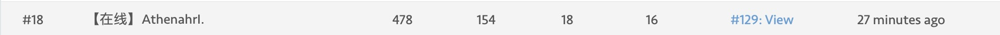

# 挑夹棋

- [挑夹棋](#挑夹棋)
  - [1. 项目背景](#1-项目背景)
  - [2. 项目文件](#2-项目文件)
  - [3. 核心实现](#3-核心实现)
    - [3.1 α-β剪枝函数](#31-α-β剪枝函数)
    - [3.2 局面评估函数](#32-局面评估函数)
    - [3.3 如何避免"乱走"](#33-如何避免乱走)
    - [3.4 4.5层？](#34-45层)
  - [4. 感悟总结](#4-感悟总结)


## 1. 项目背景

该项目是同济大学软件学院2018级C语言的课程设计项目，要求编写一个能给出挑夹棋下一步走法的程序。对战平台、信息交互和基本的程序框架是助教完成。


## 2. 项目文件

|   文件名    |        备注        |
| :---------: | :----------------: |
|   main.c    | 初始示例代码及注释 |
|   final.c   |    最终提交代码    |
| 挑夹棋final |  Google Camp讲解   |
|  Pre.pptx   |      答辩PPT       |


## 3. 核心实现

### 3.1 α-β剪枝函数

```c
int alphabeta(int depth,int alpha,int beta,char myboard[BOARD_SIZE][BOARD_SIZE],int flag) {
    char mymyboard[BOARD_SIZE][BOARD_SIZE] = {0};
    int cur_flag = 3 - flag;
    if(depth == 0) {
        return evaluate(myboard,flag);
    }
    memcpy(mymyboard,myboard,BOARD_SIZE * BOARD_SIZE * sizeof(char));//拷贝当前棋局以备用，每层要复原
    for(int i = 0;i < 8; i++){
        for(int x = 0;x < BOARD_SIZE; x++){
            for(int y = 0;y < BOARD_SIZE; y++){
                if(myboard[x][y]!= flag){
                    continue;
                }
                int new_x = x + DIR[i][0];
                int new_y = y + DIR[i][1];
                int value;
                if(isInBound(new_x,new_y) && myboard[new_x][new_y] == EMPTY){
                    myboard[new_x][new_y] = flag;//每种可能的着法
                    myboard[x][y] = EMPTY;//找到我的子并移动
                    Reverse(new_x,new_y,myboard,flag);//进行挑夹转换判断
                    value = - alphabeta(depth - 1,- beta,- alpha,myboard,cur_flag);//ab剪枝递归 <注意交换ab位置且为负值 基于负极大值搜索>
                    for(int xx = 0;xx < BOARD_SIZE; xx++){
                        for(int yy = 0;yy < BOARD_SIZE; yy++){
                            myboard[xx][yy] = mymyboard[xx][yy];//复原刚刚移动的棋盘 即撤销着法
                        }
                    }
                    if(value > alpha){
                        alpha = value;//如果出现比a大的值 更新并记录着法
                        //printf("%d\n",alpha);
                        if(depth == 4) {
                            best_x = x;
                            best_y = y;
                            best_opt = i;
                            //  printf("%d %d %d\n",x,y,i);
                        }
                    }
                    if(value >= beta)
                    {
                        return beta;
                    }
                }
                
            }
        }
    }
    return alpha;
}
```

### 3.2 局面评估函数

1. 考虑到挑夹棋的胜负是在120回合内看哪一方棋子数量多，所以选择按棋子数量进行最基本的估值。

   ```c
    for(int x = 0; x < BOARD_SIZE; x++) {
        for(int y = 0; y < BOARD_SIZE; y++) {
        	if(myboard[x][y] == flag) {
               value += 400;//每个棋子400分
           }
        }
    }
   ```

2. 加入棋形

   1. 类比象棋中的跳马位 ，当棋子互为“日”字时，对方不好进攻，构成一种比较稳定的棋局

      

   2. 将2*3跳马位扩大到2\*4

      

   3. 出现这样子的局面，限制敌方（黑）的走位，只可以选择左下或者右上，并且给此时其他地方的棋子创造机会

      

   4. 每个敌方棋子的四个角若存在我方棋子，在死局或在四步之内没有吃子局面出现时进行防守。不能让四个角同时存在，只存在一个就行

      ```c
      if(myboard[x - 1][y - 1] == flag || 
         myboard[x - 1][y + 1] == flag || 
         myboard[x + 1][y - 1] == flag || 
         myboard[x + 1][y + 1] == flag) {
            value = value + 40;
         }
      ```

   5. 针对可以进行挑、夹和不能进行挑、夹的局面进行判断并估值

### 3.3 如何避免"乱走"

- "乱走"的原因：当在四层之内并不能出现挑夹局面时，AI会选择第一个棋子的第一个可走的方向移动。
- 造成的结果：一步随机移动可能会导致被吃子
- 解决方案：在敌我双方均为四层剪枝，无法进行有效判断时，选择将棋子尽可能缩在一起来防守，避免被吃子。而方差反映数据的离散程度，方差越小，数据越集中。故计算当前局面敌我棋子的离散程度，并根据方差进行新的估值

variance()是一个double类型的函数，数据在本地调试输出然后记录：

```c
double variance(char myboard[BOARD_SIZE][BOARD_SIZE],int flag) {
    double x_average;//x平均值
    double y_average;//y平均值
    double s1,s2,s;//分别是x，y，xy的方差
    int x_sum = 0;//x坐标的和
    int y_sum = 0;//y坐标的和
    int count = 0;//棋子数目
    double x_square = 0;//x平方和
    double y_square = 0;//y平方和
    for(int x = 0; x < BOARD_SIZE; x++){
        for(int y = 0; y < BOARD_SIZE; y++){
            if(myboard[x][y] == flag){
                x_sum = x_sum + x;
                y_sum = y_sum + y;
                count = count + 1;
            }
        }
    }
    x_average = x_sum / count;
    y_average = y_sum / count;
    for(int x = 0; x < BOARD_SIZE; x++){
        for(int y = 0; y < BOARD_SIZE; y++){
            if(myboard[x][y] == flag){
                x_square = x_square + (x - x_average) * (x - x_average);
                y_square = y_square + (y - y_average) * (y - y_average);
            }
        }
    }
    s1 = sqrt(x_square/(count-1));
    s2 = sqrt(y_square/(count-1));
    s = sqrt(s1*s1+ s2 * s2);
    return s;
}

s = - variance(myboard,flag);
value = value + s;//新的估值
```


### 3.4 4.5层？

​    在一开始写估值函数的时候，一个想法是基于挑夹情况打分即构建全部可以挑夹的棋局然后给分。我认为这是一个1.5层的估值，在四层剪枝后，我将这个加入了估值函数，增强了棋力。 


## 4. 感悟总结

我在读大学前没有任何编程基础，也缺少对计算机语言的基本知识。所以在项目刚开始的时候寸步难行。很感谢XYP和XJT两位大佬，不厌其烦的为我讲解，从如何让AI走出第一步到剪枝算法再到估值函数。正是由于两位大佬的倾囊相授，使得我对于C语言的学习突飞猛进。

从没有剪枝函数只是一层的估值，到四层剪枝可以取得中规中矩的名次，再到加入不同棋型，不断调参……

从一开始的好奇到写不出来的迷茫，从20%胜率到中期50%胜率再到首次进入前20名的欣喜，直到2023年我在总结大学项目的时候，依然能回想起18年12月的凌晨，4点半早起或是晚睡为了能尽快抢到服务器资源来调参，才有了“笨鸟先飞”+“早起鸟儿有虫吃”一举冲入前10名的高光时刻:joy:，最终的名次定格在13，对自己的付出画上了一个完美的句号。




